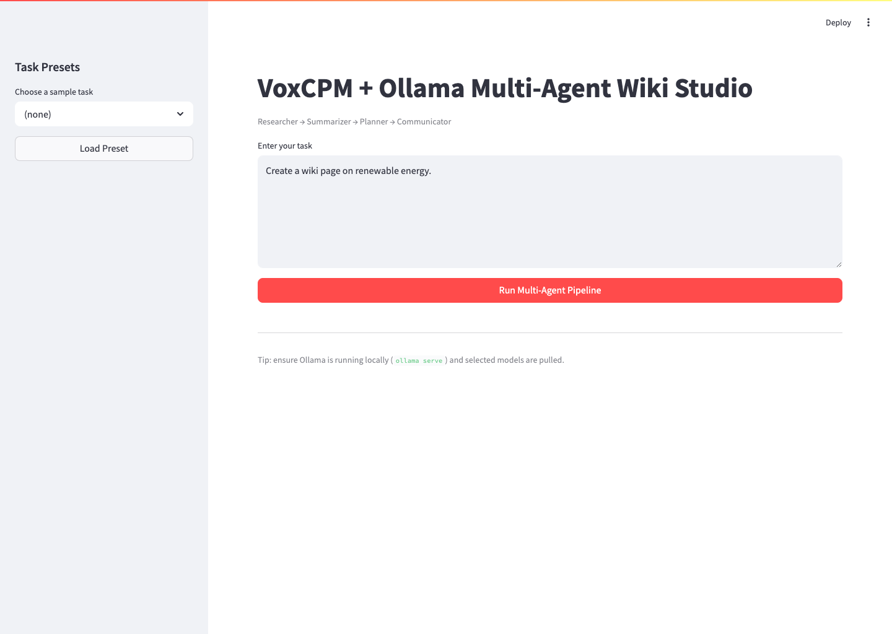
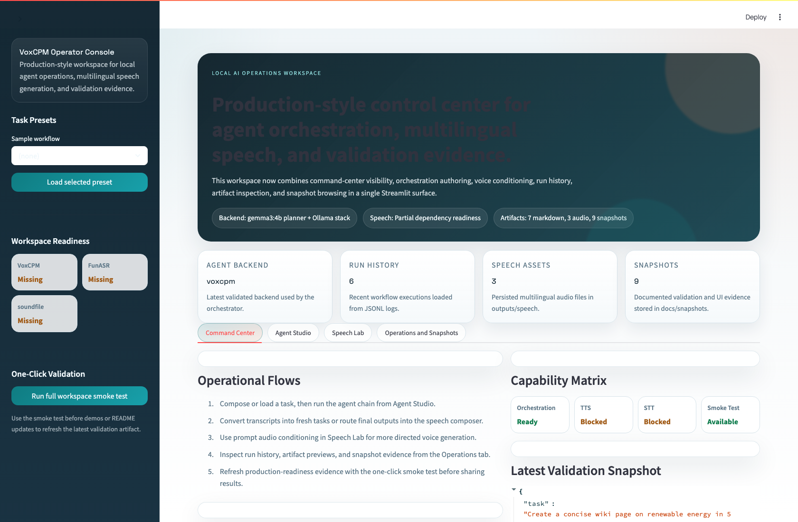
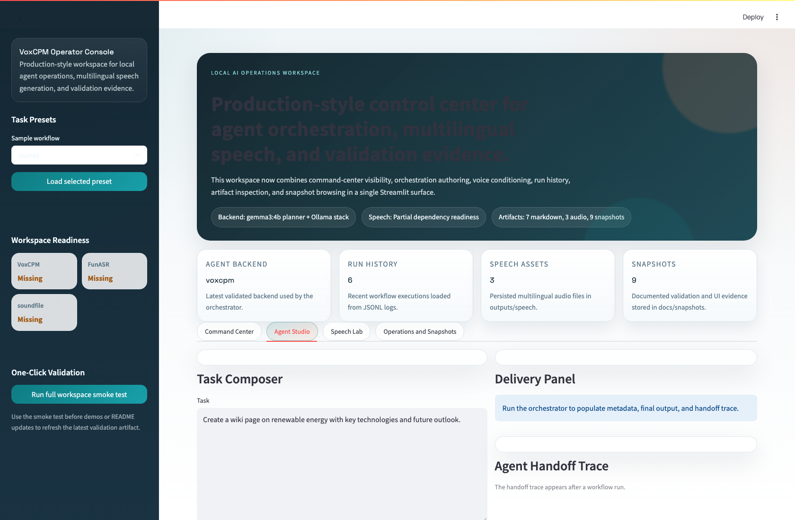
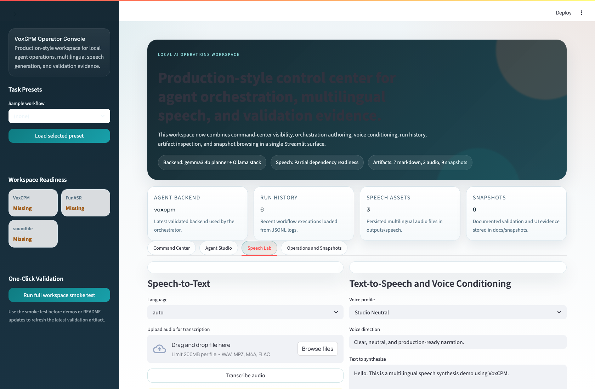
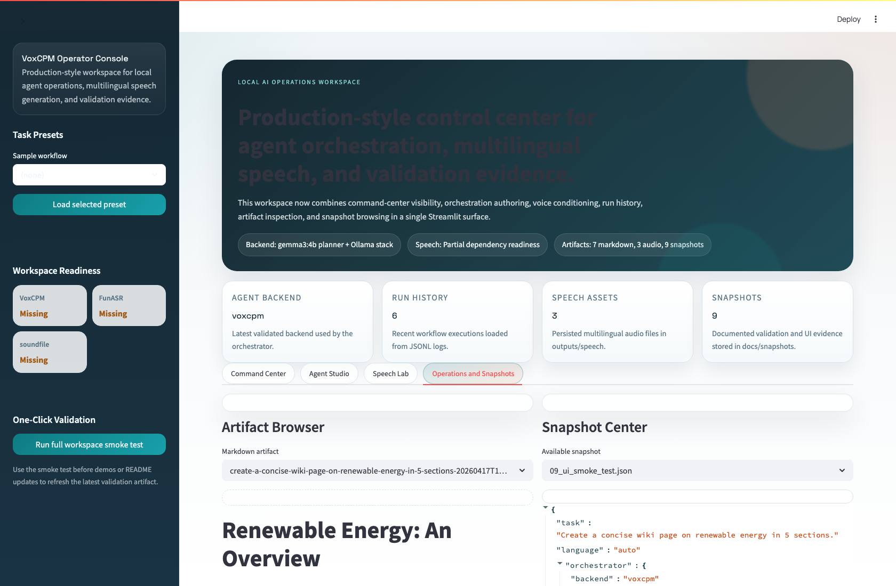

# VoxCPM + Ollama Multi-Agent and Speech Workspace

[](https://www.python.org/)
[](https://streamlit.io/)
[](https://ollama.com/)
[](https://github.com/OpenBMB/VoxCPM)
[](LICENSE)

Production-ready local AI system where specialized agents collaborate on knowledge tasks and speech workflows. The project now includes:

- Multi-agent orchestration for content generation
- VoxCPM multilingual TTS
- FunASR (SenseVoice) multilingual STT
- Streamlit production-style workspace with command center, orchestration studio, speech lab, and operations console

## Table of Contents

- [What Is Included](#what-is-included)
- [Architecture](#architecture)
- [Project Structure](#project-structure)
- [Setup](#setup)
- [Run](#run)
- [Functional Flows](#functional-flows)
- [One-Click Smoke Test](#one-click-smoke-test)
- [End-to-End Validation](#end-to-end-validation)
- [Snapshots](#snapshots)
- [Configuration](#configuration)
- [Troubleshooting](#troubleshooting)
- [Roadmap](#roadmap)
- [License](#license)

## What Is Included

### Multi-Agent Pipeline

- Researcher gathers context from local docs and external context hooks.
- Summarizer condenses findings into concise insights.
- Planner structures output into actionable sections.
- Communicator produces final wiki-ready markdown.

### Speech Capabilities

- TTS: VoxCPM model (`openbmb/VoxCPM2`) for multilingual speech generation.
- STT: FunASR SenseVoice (`iic/SenseVoiceSmall`) for multilingual transcription.
- Speech output persistence in `outputs/speech/*.wav`.

## Architecture

```text
User (Streamlit Workspace)
        |
        +--> Multi-Agent Orchestrator
        |       |
        |       +--> Researcher -> Summarizer -> Planner -> Communicator -> Markdown Output
        |                                                   |
        |                                                   +--> outputs/*.md
        |                                                   +--> outputs/agent_logs.jsonl
        |
        +--> Speech Studio
                |
                +--> VoxCPM TTS (text -> wav)
                +--> FunASR STT (audio -> text)
                |
                +--> outputs/speech/*.wav

Backends:
- Ollama for agent reasoning models
- VoxCPM for multilingual TTS
- FunASR SenseVoice for multilingual STT
```

## Project Structure

```text
agent_voxcpm/
├── app.py
├── orchestrator.py
├── speech.py
├── ollama_client.py
├── utils.py
├── config.yaml
├── requirements.txt
├── Dockerfile
├── README.md
├── scripts/
│   └── e2e_validate.py
├── agents/
│   ├── researcher.py
│   ├── summarizer.py
│   ├── planner.py
│   └── communicator.py
├── sample_tasks/
├── outputs/
└── docs/
    └── snapshots/
```

## Setup

### Prerequisites

1. Python 3.11+
2. Ollama installed locally
3. Homebrew ffmpeg (required for FunASR audio decoding on macOS)
4. Recommended local Ollama models: `llama3`, `mistral`, `gemma3:4b`

### Install

```bash
python -m venv .venv
source .venv/bin/activate
pip install -r requirements.txt
pip install git+https://github.com/OpenBMB/VoxCPM.git
brew install ffmpeg
```

### Ollama Models

```bash
ollama serve
ollama pull llama3
ollama pull mistral
ollama pull gemma3:4b
```

## Run

### Streamlit Workspace

```bash
streamlit run app.py
```

After launch:

1. Start in `Command Center` for readiness and quick actions.
2. Use `Agent Studio` for authoring tasks and reviewing handoff traces.
3. Use `Speech Lab` for STT, TTS, and optional prompt-audio voice conditioning.
4. Use `Operations and Snapshots` to inspect outputs, logs, and saved evidence.
5. Use sidebar `Run full workspace smoke test` to execute full orchestrator + STT/TTS verification from the UI.

### Programmatic E2E Validation

```bash
python scripts/e2e_validate.py --speech-text "Hello world. This is VoxCPM multilingual speech verification." --language auto
```

## Functional Flows

### Flow A: Multi-Agent Wiki Generation

1. User enters task in `Multi-Agent Orchestrator` tab.
2. Researcher -> Summarizer -> Planner -> Communicator handoff chain executes.
3. Final markdown appears in UI.
4. Artifacts are persisted to `outputs/` and `outputs/agent_logs.jsonl`.

### Flow B: Speech Lab

1. User uploads audio in `Speech Lab` and runs STT.
2. Transcript is produced via SenseVoice and can be reused as TTS input.
3. User enters/edits text and generates multilingual speech with VoxCPM.
4. WAV output is playable and downloadable in the UI.

### Flow C: Production Workspace Operations

1. `Command Center` shows capability matrix, latest validation JSON, and workflow shortcuts.
2. `Agent Studio` includes run history, metadata panel, markdown export, and full agent handoff trace.
3. `Speech Lab` adds voice presets plus optional prompt-audio and prompt-text conditioning.
4. `Operations and Snapshots` provides artifact browser, log inspector, and snapshot center.

### Flow D: Unified Validation

1. `scripts/e2e_validate.py` runs orchestration.
2. Script runs VoxCPM TTS.
3. Script runs FunASR STT on generated WAV.
4. Summary is persisted in `docs/snapshots/08_e2e_speech_validation.json`.

## One-Click Smoke Test

The Streamlit sidebar includes a single action button:

- `Run Full Workspace Smoke Test`

What it does:

1. Runs the multi-agent orchestrator on a fixed validation task.
2. Generates speech with VoxCPM.
3. Transcribes the generated speech with FunASR.
4. Persists a UI-triggered validation summary to `docs/snapshots/09_ui_smoke_test.json`.
5. Displays the latest smoke test result in `Command Center` and `Operations and Snapshots`.

## End-to-End Validation

Last validated with real dependency execution:

- Orchestrator backend: `voxcpm`
- Message handoffs: `5`
- TTS: `ok` with generated 48kHz WAV
- STT: `ok` with transcribed output

Validation artifact:

- [docs/snapshots/08_e2e_speech_validation.json](docs/snapshots/08_e2e_speech_validation.json)

## Snapshots

- Ollama model inventory: [docs/snapshots/01_ollama_tags.json](docs/snapshots/01_ollama_tags.json)
- Python compile validation: [docs/snapshots/02_compileall.txt](docs/snapshots/02_compileall.txt)
- Orchestrator run summary: [docs/snapshots/03_e2e_run_summary.json](docs/snapshots/03_e2e_run_summary.json)
- Output preview: [docs/snapshots/04_e2e_output_preview.md](docs/snapshots/04_e2e_output_preview.md)
- Streamlit startup log: [docs/snapshots/05_streamlit_startup.txt](docs/snapshots/05_streamlit_startup.txt)
- Agent log sample: [docs/snapshots/06_agent_log_last_run.json](docs/snapshots/06_agent_log_last_run.json)
- Updated UI screenshot: [docs/snapshots/07_streamlit_ui.png](docs/snapshots/07_streamlit_ui.png)
- Speech-enabled e2e summary: [docs/snapshots/08_e2e_speech_validation.json](docs/snapshots/08_e2e_speech_validation.json)
- UI-triggered smoke test summary: [docs/snapshots/09_ui_smoke_test.json](docs/snapshots/09_ui_smoke_test.json)
- Command Center view: [docs/snapshots/10_ui_command_center.png](docs/snapshots/10_ui_command_center.png)
- Agent Studio view: [docs/snapshots/11_ui_agent_studio.png](docs/snapshots/11_ui_agent_studio.png)
- Speech Lab view: [docs/snapshots/12_ui_speech_lab.png](docs/snapshots/12_ui_speech_lab.png)
- Operations and Snapshots view: [docs/snapshots/13_ui_operations_snapshots.png](docs/snapshots/13_ui_operations_snapshots.png)
- Upgraded workspace e2e summary: [docs/snapshots/14_e2e_workspace_validation.json](docs/snapshots/14_e2e_workspace_validation.json)







## Configuration

Main runtime settings are in `config.yaml`.

- `ollama`: local LLM endpoint and timeout
- `agents`: model, temperature, prompts per agent
- `storage`: markdown and log output locations
- `speech`:
  - `voxcpm_model_id`
  - `asr_model_id`
  - `speech_output_dir`
  - `enable_tts`, `enable_stt`
  - synthesis defaults (`tts_cfg_value`, `tts_inference_timesteps`)

## Troubleshooting

### STT fails with ffmpeg error

Install ffmpeg:

```bash
brew install ffmpeg
```

### VoxCPM model download is slow

Set `HF_TOKEN` for faster and higher-limit Hugging Face downloads.

### Backend shows `local-fallback`

Install VoxCPM package and restart run.

```bash
pip install git+https://github.com/OpenBMB/VoxCPM.git
```

### Ollama connection errors

```bash
ollama serve
curl http://localhost:11434/api/tags
```

## Roadmap

1. Parallel agent graph execution
2. Structured evaluation metrics per run
3. Human approval checkpoint before final publish
4. Optional RAG connector for larger corpora

## License

MIT (see [LICENSE](LICENSE)).
